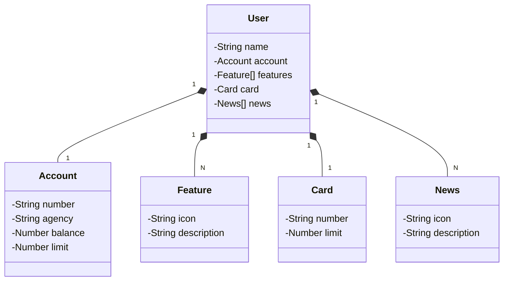

# SANTANDER DEV WEEK 2024
Este repositório representa a segunda versão do meu projeto final na Digital Innovation One. Aqui pude reforçar todo o meu aprendizado e implementar funcionalidades de forma mais profissional, focando nos detalhes para garantir o máximo desempenho.
Nesta aplicação, é possível cadastrar, consultar, atualizar e deletar usuários através do Swagger/OpenAPI. Para aqueles interessados em realizar testes, segue a estrutura JSON:

[](https://github.com/WallissonAlv/santander-dev-week/blob/main/LICENSE)

```json
{
  "name": "NOME_DO_USUARIO",
  "account": {
    "number": "NUMERO_CONTA",
    "agency": "AGENCIA",
    "balance": 0,
    "creditLimit": 0
  },
  "card": {
    "number": "NUMERO_DO_CARTAO",
    "limit": 0
  },
  "features": [
    {
      "icon": "URL",
      "description": "Descricao da Feature"
    }
  ],
  "news": [
    {   
      "icon": "URL",
      "description": "Descricao da Novidade"
    }
  ]
}
```
## Principais Tecnologias
 - **Java 8**: Versão LTS do Java para tirar vantagem das inovações que essa linguagem robusta e amplamente utilizada oferece;
 - **Spring Boot 2.7.12**: Maximiza a produtividade do desenvolvedor por meio de sua poderosa premissa de autoconfiguração;
 - **Spring Data JPA**: Simplificar nossa camada de acesso aos dados, facilitando a integração com bancos de dados SQL;
 - **OpenAPI (Swagger)**: Vamos criar uma documentação de API eficaz e fácil de entender usando a OpenAPI (Swagger), perfeitamente alinhada com a alta produtividade que o Spring Boot oferece;
 - **Railway**: facilita o deploy e monitoramento de nossas soluções na nuvem, além de oferecer diversos bancos de dados como serviço e pipelines de CI/CD.

## [Link do Figma](https://www.figma.com/file/0ZsjwjsYlYd3timxqMWlbj/SANTANDER---Projeto-Web%2FMobile?type=design&node-id=1421%3A432&mode=design&t=6dPQuerScEQH0zAn-1)

O Figma foi utilizado para a abstração do domínio desta API, sendo útil na análise e projeto da solução.

## Diagrama de Classes (Domínio da API)


